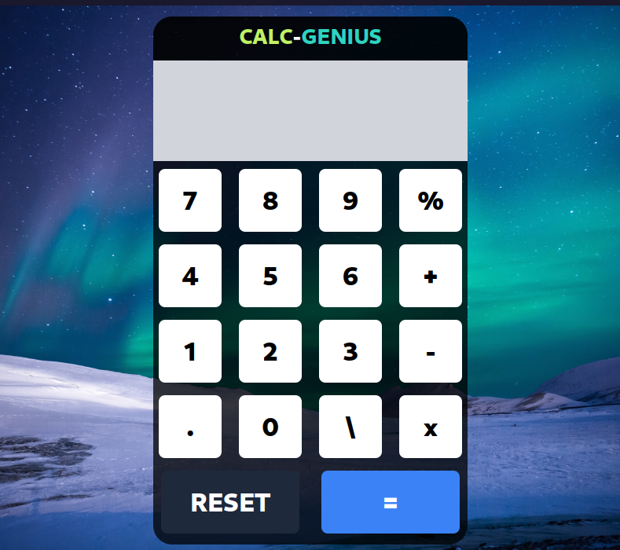

# Feito com Tauri é ReactJS com Typescript

Código no Terminal para Iniciar a Aplicação Corretamente

```bash
yarn
yarn tauri dev
```

Transforme em Executável, Inserindo Estes Comandos no Terminal
```bash
yarn tauri build
```

# Calc-Genius
Uma Calculadora Simples e Fácil de Manipular com Tauri e ReactJS

<div
style="
margin-top: 30px;
margin-bottom:30px;
">

<h2 
align="center"
style="
margin-bottom:30px;
">
CalcGenius
</h2>



<p
align="center"
>
Lucas é um estudante universitário de engenharia que está sempre envolvido em cálculos complexos para suas disciplinas. Ele fica frustrado com as calculadoras online disponíveis, que são cheias de recursos desnecessários e difíceis de usar. Em busca de uma solução mais simples, Lucas descobre o "Calc-Genius". Uma aplicação que de fato resolve todos os 
seus problemas
</p>

</div>
