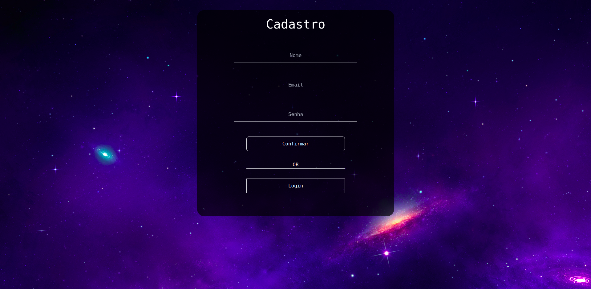
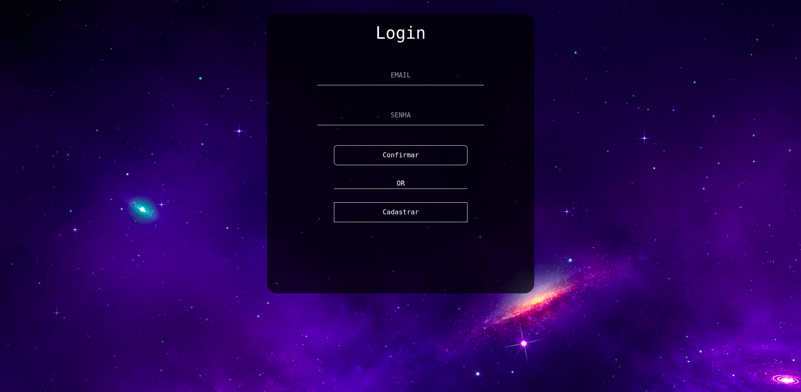
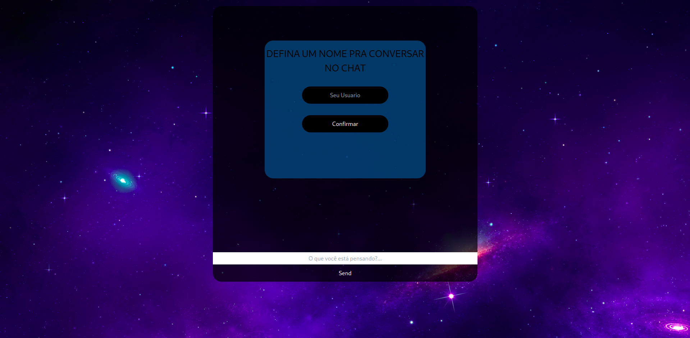
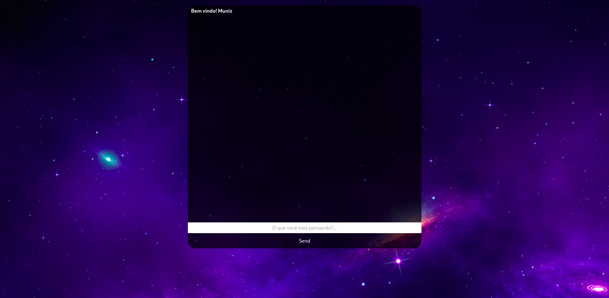

<h1
style='
display:block;
position:relative;
font-size: 30pt;
margin-bottom:2rem;
'>Full-Stack Chat</h1>

<h1
style='
position:relative;
display:block;
text-align:center;
margin-bottom:2rem;
'>OBS</h1>

<li
style='
position: relative;
margin-bottom: 2rem;
'>
Usar <code>yarn add</code> em ambos os 2   
para a instalação de todas dependencias
[Client,Server]
</li>

<li>
Criar um <code>.env</code> com a URL do seu banco de dados, apenas pro prisma conseguir se connectar ,
é criar uma tabela com as credencias passadas pelo
usuario
</li>

<h2
style='
display: block;
position: relative;
text-align: center;
font-size: 20pt;
margin-bottom: 1.6rem;
'>Cadastro</h2>

A Home do cadastro tem como objetivo,
  
criar o 
cadastro do usuario , 
 
para ele ter o acesso
ao chat global

<!-- Login -->

<h2
style='
display: block;
position: relative;
text-align: center;
font-size: 20pt;
margin-bottom: 1.6rem;
'>Login</h2>

O Login tem como objetivo,
  
Verificar a existencia do usuario no banco de dados. 
 
Se as credencias passadas estiverem corretas!!
 
o usuario será redirecionado para o chat. 
  
Caso contrario receberar um aviso dizendo , 
  
que as credencias passadas estão 
incorretas.
 

<!-- Chat -->

<h2
style='
display: block;
position: relative;
text-align: center;
font-size: 20pt;
margin-bottom: 1.6rem;
'>Username</h2>

Nesse momento o usuario está totalmente livre,
 
para poder escolher o nome que deseja

<!-- Conversa no Chat -->

<h2
style='
display: block;
position: relative;
text-align: center;
font-size: 20pt;
margin-bottom: 1.6rem;
'>Hello User</h2>

Após definir um nome , terá total liberdade
para expressar sua opinião , e seus pensamentos, 

