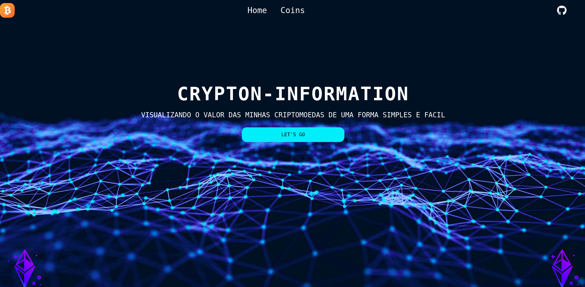
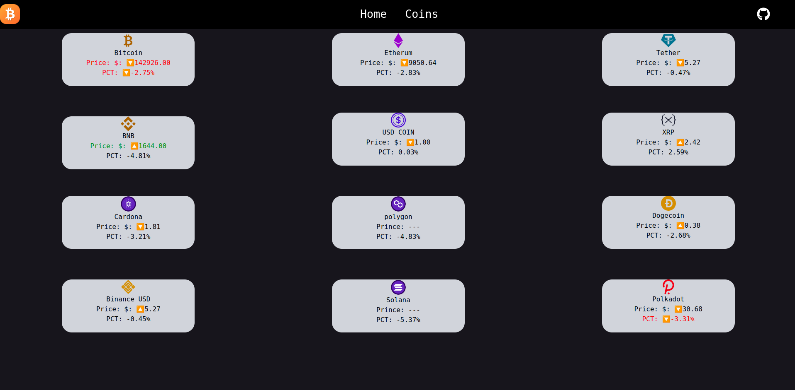

## Getting Started
First, run the development server:
```bash
npm run dev
# or
yarn dev
# or
pnpm dev
```
Open [http://localhost:3000](http://localhost:3000) with your browser to see the result.

```bash
```

<center><h1>Home</h1></center>



<center><h2>Seja Bem vindo a Home</h2></center>

```bash
```
<center><h1>Criptomoedas</h1></center>


<center><h2>Ao apertar no coin, você será redirecionado para o campo das criptomoedas e terá uma ampla visão de seus respectivos valores</h2></center>

